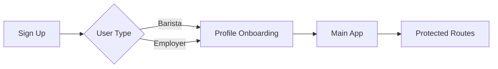

# Beyond The Bar - Professional Networking for Baristas

A modern, full-stack web application for baristas to build professional profiles, earn skill badges, receive peer reviews, and find job opportunities in the coffee industry.

   

## 🚀 Quick Start

### Prerequisites
- Node.js 18+ and npm
- Firebase account (free tier works)

### Installation

```bash
# 1. Install dependencies
npm install

# 2. Copy environment template
cp .env.example .env

# 3. Configure Firebase (see FIREBASE_SETUP.md for detailed guide)
# Edit .env with your Firebase credentials

# 4. Start development server
npm run dev

# 5. Open browser at http://localhost:5173
```

**📖 See [FIREBASE_SETUP.md](./FIREBASE_SETUP.md) for complete Firebase configuration guide**

## ✨ Features (100% Complete MVP)

### For Baristas:
- ✅ **Profile Management** - Showcase work history, certifications, coffee philosophy
- ✅ **Badge System** - Earn 44+ skill badges across 8 categories
- ✅ **Peer Reviews** - 3-tier credibility system (Colleague 2x, Industry, Customer)
- ✅ **Job Board** - Browse opportunities with badge-based recommendations
- ✅ **Notifications** - Real-time updates for badges, reviews, verifications
- ✅ **Profile Photos** - Upload and manage professional photos with compression

### For Employers:
- ✅ **Job Posting** - Create detailed listings with badge requirements
- ✅ **Analytics Dashboard** - Track team performance with visualizations
- ✅ **Badge Analytics** - See most common skills across team
- ✅ **Review Trends** - 12-month performance tracking with charts
- ✅ **Top Performers** - Identify high-performing team members

## 🏗️ Tech Stack

| Layer | Technology |
|-------|-----------|
| **Frontend** | React 19 + TypeScript + Vite |
| **Styling** | Tailwind CSS v4 (custom coffee theme) |
| **State** | Zustand (lightweight, fast) |
| **Forms** | React Hook Form + Zod validation |
| **Backend** | Firebase (Auth, Firestore, Storage) |
| **Routing** | React Router v6 |

## 📁 Project Structure

```
src/
├── components/          # Reusable UI components
│   ├── analytics/       # Dashboard charts, stats cards
│   ├── badges/          # Badge cards, showcase
│   ├── jobs/            # Job cards, filters, posting form
│   ├── layout/          # Header, Footer, Layout wrapper
│   ├── notifications/   # Notification bell, list
│   ├── profile/         # Profile editing, photo upload
│   └── reviews/         # Review submission, display
├── config/              # Firebase configuration
├── constants/           # Badge definitions (44 badges)
├── contexts/            # Auth context provider
├── pages/               # Page components (14 routes)
├── services/            # API services layer
│   ├── analytics.service.ts    # Team analytics
│   ├── auth.service.ts         # Authentication
│   ├── job.service.ts          # Job CRUD
│   ├── notification.service.ts # Notifications
│   ├── review.service.ts       # Reviews & badges
│   ├── storage.service.ts      # File uploads
│   └── user.service.ts         # User profiles
├── store/               # Zustand state management
├── types/               # TypeScript definitions
└── App.tsx              # Main app with routing
```

## 🎨 Design System

Coffee-themed color palette:
```css
--color-coffee-primary: #8B4513;    /* Rich coffee brown */
--color-coffee-accent: #DAA520;     /* Golden latte */
--color-badge-gold: #FFD700;
--color-badge-silver: #C0C0C0;
--color-badge-bronze: #CD7F32;
```

## 🏆 Badge System

### 44 Badges Across 8 Categories:

| Category | Badges | Examples |
|----------|--------|----------|
| **Technique** | 9 | Latte Art Wizard, Espresso Alchemist, Milk Maestro |
| **Speed** | 6 | Rush Hour Hero, Flow State Master, Efficiency Expert |
| **Service** | 6 | Regular Whisperer, Vibe Curator, Conflict Resolver |
| **Teamwork** | 6 | New Hire Mentor, Shift Coordinator, Training Champion |
| **Knowledge** | 6 | Origin Storyteller, Brewing Encyclopedia, Equipment Guru |
| **Special** | 6 | Solo Bar Survivor, Catering Champion, Competition Ready |
| **Personality** | 6 | Coffee Philosopher, Detail Obsessed, Energy Bringer |
| **Legendary** | 4 | Barista Sensei, Coffee Sommelier, Industry Leader |

### Badge Levels:
- **Bronze** 🥉 - 3 tags (entry level)
- **Silver** 🥈 - 8 tags (proficient)
- **Gold** 🥇 - 20 tags (expert)
- **Legendary** 👑 - 30+ tags + special criteria

### Weighted Scoring:
- **Tier 1 (Colleague)** reviews = **2x weight** (requires verification)
- **Tier 2 (Industry)** reviews = 1x weight
- **Tier 3 (Customer)** reviews = badges only (optional opt-in)

## 📊 Review System

### 3-Tier Credibility Model:

1. **Tier 1 - Colleagues** 🤝
   - Co-workers from same workplace
   - Requires verification by reviewee
   - Counts 2x toward badge progression
   - Highest trust level

2. **Tier 2 - Industry Peers** ☕
   - Baristas from other cafes
   - Industry professionals
   - 1x weight for badges

3. **Tier 3 - Customers** 👤
   - Public/customer reviews
   - Optional (can disable in settings)
   - Badges only, no negative impact

### Privacy Features:
- Reviews under 4 stars hide comments from reviewee
- Employers see all review details
- Users control visibility in settings
- No public ratings by default

## 🔐 Authentication Flow



1. Sign up as Barista or Employer
2. Complete onboarding (location, bio, workplace)
3. Access full features

## 🚀 Deployment Options

### Option 1: Vercel (Recommended - Fastest)

```bash
# Install Vercel CLI
npm install -g vercel

# Deploy
vercel

# Add environment variables in Vercel dashboard
```

### Option 2: Firebase Hosting

```bash
# Install Firebase CLI
npm install -g firebase-tools

# Login and initialize
firebase login
firebase init hosting

# Build and deploy
npm run build
firebase deploy
```

### Option 3: Netlify

```bash
# Install Netlify CLI
npm install -g netlify-cli

# Build
npm run build

# Deploy
netlify deploy --prod
```

## 🔧 Available Scripts

```bash
npm run dev          # Start dev server (Vite)
npm run build        # Production build
npm run preview      # Preview production build
npm run lint         # Run ESLint
```

## 📱 Mobile Responsiveness

Fully responsive design with breakpoints:
- **Mobile**: 320px - 640px (single column, touch-optimized)
- **Tablet**: 641px - 1024px (adaptive layouts)
- **Desktop**: 1025px+ (multi-column, full features)

All components use Tailwind responsive classes (`sm:`, `md:`, `lg:`, `xl:`)

## 🧪 Testing the App

### Create Test Accounts:

1. **Barista Account** - test@barista.com
   - Complete profile onboarding
   - Add work history
   - Upload profile photo
   - View badge showcase

2. **Barista Account 2** - test2@barista.com
   - Give review to first barista
   - Test Tier 1 verification flow

3. **Employer Account** - test@employer.com
   - Post a job
   - View analytics dashboard
   - See team performance

### Test Core Flows:
- ✅ Sign up → Onboarding → Profile creation
- ✅ Give review → Verify Tier 1 → Badge progression
- ✅ Upload photo → Compression → Storage
- ✅ Post job → Filter → Apply
- ✅ View analytics → Charts → Insights

## 🐛 Troubleshooting

### Common Issues:

**Firebase Permission Errors:**
```
Solution: Check Firestore/Storage rules in Firebase Console
```

**Build Errors:**
```bash
rm -rf node_modules .vite
npm install
npm run build
```

**Environment Variables Not Loading:**
```
- Ensure .env file exists
- Restart dev server after changing .env
- Verify VITE_ prefix on all variables
```

## 🔒 Security Notes

### Before Production:
- [ ] Review and tighten Firestore security rules
- [ ] Enable App Check for abuse prevention
- [ ] Set up Firebase quotas and billing alerts
- [ ] Add rate limiting for API calls
- [ ] Enable CORS restrictions
- [ ] Set up monitoring and alerts
- [ ] Review Storage rules and quotas

## 🌐 Browser Support

- Chrome/Edge: 100+ ✅
- Firefox: 100+ ✅
- Safari: 15+ ✅
- Mobile Safari: iOS 15+ ✅
- Chrome Mobile: Android 10+ ✅

## 📦 Bundle Size

Current production build:
- **JS**: ~827 KB (minified)
- **CSS**: ~29 KB
- **Total First Load**: ~856 KB

Consider code splitting for optimization in next phase.

## 🔮 Future Enhancements

- [ ] React Native mobile apps (iOS/Android)
- [ ] Direct messaging between users
- [ ] Video introductions
- [ ] Advanced job matching ML algorithm
- [ ] Team/cafe organization profiles
- [ ] SCA/CQI certification integration
- [ ] Multi-language support (i18n)
- [ ] Social media sharing
- [ ] Webhook integrations
- [ ] Public profile URLs

## 📊 Database Schema

See [FIREBASE_SETUP.md](./FIREBASE_SETUP.md) for complete collection structures.

## 🤝 Contributing

To contribute:
1. Fork the repository
2. Create feature branch (`git checkout -b feature/AmazingFeature`)
3. Commit changes (`git commit -m 'Add AmazingFeature'`)
4. Push to branch (`git push origin feature/AmazingFeature`)
5. Open Pull Request

## 📄 License

MIT License - See LICENSE file for details

## 📞 Support

- **Issues**: Open a GitHub issue
- **Docs**: See [FIREBASE_SETUP.md](./FIREBASE_SETUP.md)
- **Email**: support@beyondthebar.app

---

**Built with ☕ by coffee lovers, for coffee professionals**

*Last Updated: 2025-11-18*
